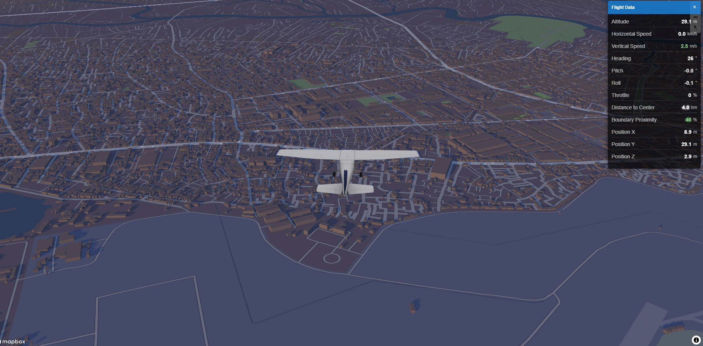

# ThongNhatDatNuoc Flight Simulator - A Vibe Coding Game

A simple 3D flight simulator built with TypeScript, Three.js, and Mapbox GL JS that allows you to fly over realistic map.



## 🚀 Getting Started

### Prerequisites

- Node.js (v16 or higher)
- NPM or Yarn
- A Mapbox access token

### Installation

1. Clone the repository:
   ```bash
   git clone
   cd thongnhatdatnuoc
   ```

2. Install dependencies:
   ```bash
   npm install
   # or with yarn
   yarn
   ```

3. Create a `.env` file in the project root and add your Mapbox token:
   ```
   VITE_MAPBOX_ACCESS_TOKEN=your_mapbox_token_here
   ```

4. Start the development server:
   ```bash
   npm run dev
   # or with yarn
   yarn dev
   ```

5. Open your browser and navigate to `http://localhost:3004`

## 🎮 Flight Controls

- **W/S**: Pitch up/down and move up/down
- **A/D**: Roll left/right
- **Q/E**: Yaw left/right
- **Space**: Increase forward speed
- **Shift**: Decrease forward speed
- **C**: Change camera view

## 🔧 Configuration

The simulator is highly configurable through the `config.ts` file. You can adjust:

- Flight physics parameters
- Aircraft performance characteristics
- Map settings and boundary configuration
- Camera behavior and visual effects

## 🙏 Acknowledgements

- [Three.js](https://threejs.org/)
- [Mapbox GL JS](https://docs.mapbox.com/mapbox-gl-js/api/)
- [TypeScript](https://www.typescriptlang.org/)
- [Vite](https://vitejs.dev/)
- [GitHub Copilot](https://github.com/features/copilot)
- [Zapsplat](https://www.zapsplat.com)
- [FAB](https://www.fab.com/)